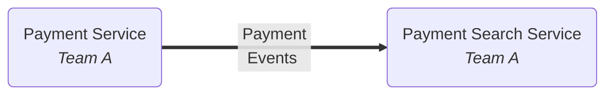
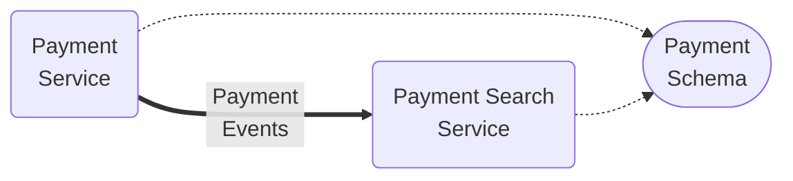
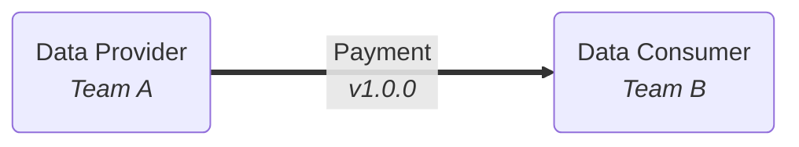
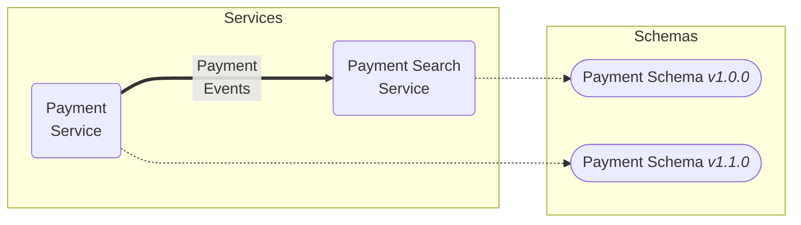

# Decoupled services, data evolution, and semantic versioning

Imagine the following scenario.

1. There are two teams. Team A owns a **Payment Service**, which records payments, and Team B owns a **Payment Search Service**, which can be used to look up payments quickly.
2. Payment Events flow from the Payment Service to the Payment Search Service, so the latter can keep its index up-to-date.

Let's imagine that both teams agree to use a schema called `payment.schema.json` to check that data they are sending or receiving is valid.

That's great! Or is it? Later, Team A want to add a new feature which needs a new mandatory property `terms`in the Payment data. What is the right approach?

## The bad way, take 1

1. Team A makes their changes to the schema and service.
2. Team A deploys the new schema.

   > [!WARNING]
   >
   > If either service restarts or scales at this point, it will break because it will re-read the schema which now expects a property that neither service is sending/receiving.

3. Team A deploys their new service.
4. Team B's service will break **if** the new data format is incompatible with the schema they are still using, but it's hard for either team to check that.

## The bad way, take 2

1. Team A calls Team 2 and says "We need to change the Payment Instruction schema."
2. Team B are annoyed. They have their own priorities, but they agree to work together on changing their services
3. They both attempt to deploy their changes to production at the same time, but that is almost impossible in practice, and there is a period where things are broken, and the teams have to work together to patch issues that result.

**This is just for two teams.** Imagine the pain if there were 10 services and 10 teams all relying on each other's schemas!

## The right way, using semantic versioning

[Semantic versioning](https://semver.org/) is a way of versioning software that allows you to identify nature of changes between versions. It is a three-part version number `<major>.<minor>.<patch>`, e.g. `1.2.3`.

For data, it is useful to imagine a data provider and a data consumer - like the Payment Service and Payment Search Service in our example. The data provider is the service that creates the data, and the data consumer is the service that consumes the data.

- `major` - A breaking change - i.e. when the changed data is received by a consumer, it will break it.
- `minor` - A feature change in the data which will not break a consumer.
- `patch` - A bug fix in the data which will not break a consumer

If a JSON schema includes a semantic version, then we can use it to identify situations when we can safely deploy data providers in isolation, and when we need to provide support for multiple data streams simultaneously to allow consumers to migrate at their own pace.

> [!TIP]
>
> JSM explicitly checks whether a supposedly 'non-breaking' change will actually break consumers when deployed, long before implementation begins.

Imagine the original schema is `payment-1_0_0.schema.json`.

So now, the process is as follows:

1. Team A create a new version of the payment schema, `payment-1_1_0.schema.json`. They think it should be a non-breaking feature change, so they increment the minor version number.
2. They use `jsm validate all` to check that the change is not breaking.
3. The tests pass, and they deploy the new version of the schema.
4. Team A now deploys the new version of the Payment Service, which uses the new schema.
5. Team B's service is unaffected. It is still using the old schema, and that schema validates the new version of the data without a problem, as validated by JSM earlier.
6. Team B can now choose to upgrade to the new schema at their own pace.

